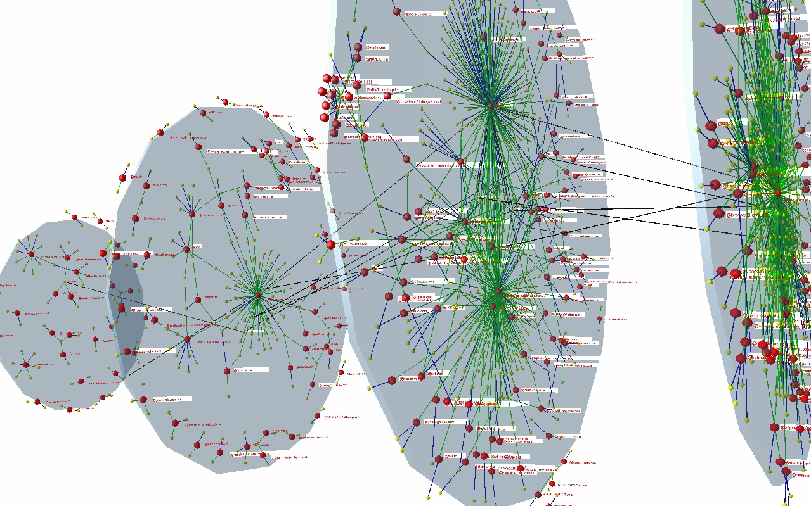

## Time evolving networks

In the last decades, the human communication fell through a crucial transition. Thanks to the
Internet, which connects all individuals around the globe, everybody can contact each other
without any time delay and without geographical restrictions. Social interactions became cheap
and worldwide, the only restriction remained at the human side: all of us are able to process
information at a finite rate and can engage trustful relations only with a few tens or hundreds
of others. Therefore, describing and modelling of the new type of human interactions called for
a description which is free of space limitations: these represent the tools of Network Science.

Real systems are usually not static, instead they evolve in time. This can manifest in the
emergence of new parts, the disappearance of existing parts, and also the relations among
constituents can be rearranged over time. In this project you will challenged to create simulations
for time depending networks.

1. Install softwares and libraries for network analysis and simulation! Experiment with data exchange between the installed tools.
Demostrate, that you can load the same network in all tools and libraries, can modify them and the output can be loaded into all
other tools!

2. Experiment with different representations of time evolving networks! Calculate the centrality measures for an evolving network
from a network data repository (e.g. URL). 

3. Explore the time dependent weighted network of mobile phone calls in northern Italy https://dandelion.eu/datamine/open-big-data/:
find basic repetitive patterns (daily, weekly etc), locate outlier events! 

4. Try to define two types of networks and find differences between them:
a. average call intensity between cells.
b. similary matrix of call intensity in cells (e.g. take the time series of calls for a day in two cells and calculate the correlation coefficient
between these series for each days).

5. Find clusters in the above evolving networks and visualize the evolution of the clusters! Create a movie and create a sankey diagram!
Find other possibilities to visualize the evolution of the topology of networks! 

6. Create randomized versions of the above networks! Where are significantly differences from random behavior? 

Bonus:
* create a 3D, interactive demo of time evolving networks in the 3D Virtual Reality Lab!
* create a movie of the time evolution of networks on curved surface (planetarium)

Relevant literature:
* Barlacchi, G. et al. A multi-source dataset of urban life in the city of
Milan and the Province of Trentino. Sci. Data 2, 150055 (2015). 
https://www.nature.com/articles/sdata201555.pdf

Further reading and tools:
* See the appropriate sections in the [Static network project](../networx/)